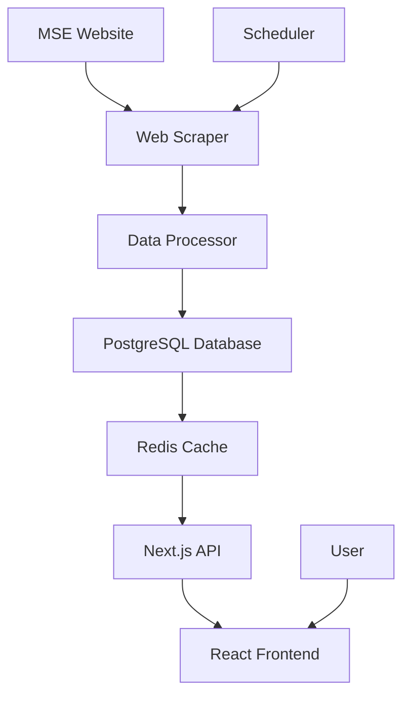

# Technical Specification Document
## MSE Stock Tracker - Architecture & Implementation Guide

### 1. System Architecture Overview

#### 1.1 High-Level Architecture



#### 1.2 Technology Stack

**Frontend:**
- Next.js 14+ (App Router)
- TypeScript
- Tailwind CSS
- shadcn/ui
- Recharts/Chart.js
- Zustand (State Management)
- TanStack Query (Data Fetching)

**Backend:**
- Next.js API Routes
- Node.js
- PostgreSQL
- Redis
- Puppeteer/Playwright

**DevOps & Deployment:**
- Vercel (Primary hosting)
- GitHub Actions (CI/CD)
- PostgreSQL (Supabase/Neon)
- Redis (Upstash)

### 2. Data Scraping Implementation

#### 2.1 Web Scraping Strategy

**Target URLs:**
- Main page: `https://www.mse.mk/en`
- Individual stocks: `https://www.mse.mk/en/symbol/{SYMBOL}`
- Historical data: `https://www.mse.mk/en/stats/symbolhistory/{SYMBOL}`
- Daily reports: Excel downloads from MSE

**Scraping Schedule:**
- Market hours: Every 30 seconds
- After hours: Every 5 minutes
- Historical data: Daily at market close
- Company data: Weekly

#### 2.2 Puppeteer Implementation

```typescript
// Example scraper implementation
class MSEScraper {
  private browser: Browser;
  
  async scrapeLiveData(): Promise<StockData[]> {
    const page = await this.browser.newPage();
    await page.goto('https://www.mse.mk/en');
    
    // Extract stock data from the main page
    const stocks = await page.evaluate(() => {
      const stockElements = document.querySelectorAll('.stock-item');
      return Array.from(stockElements).map(element => ({
        symbol: element.querySelector('.symbol')?.textContent,
        price: parseFloat(element.querySelector('.price')?.textContent || '0'),
        change: parseFloat(element.querySelector('.change')?.textContent || '0'),
        volume: parseInt(element.querySelector('.volume')?.textContent || '0')
      }));
    });
    
    await page.close();
    return stocks;
  }
}
```

#### 2.3 Data Validation & Processing

```typescript
interface RawStockData {
  symbol: string;
  price: number;
  change: number;
  volume: number;
  timestamp: Date;
}

class DataProcessor {
  validateStockData(data: RawStockData): boolean {
    return (
      typeof data.symbol === 'string' &&
      data.symbol.length > 0 &&
      typeof data.price === 'number' &&
      data.price > 0 &&
      typeof data.change === 'number' &&
      typeof data.volume === 'number' &&
      data.volume >= 0
    );
  }
  
  processStockData(rawData: RawStockData[]): ProcessedStockData[] {
    return rawData
      .filter(this.validateStockData)
      .map(data => ({
        ...data,
        changePercent: (data.change / (data.price - data.change)) * 100,
        marketCap: this.calculateMarketCap(data.symbol, data.price),
        timestamp: new Date()
      }));
  }
}
```

### 3. Database Schema

#### 3.1 PostgreSQL Tables

```sql
-- Companies table
CREATE TABLE companies (
  id SERIAL PRIMARY KEY,
  symbol VARCHAR(10) UNIQUE NOT NULL,
  name VARCHAR(255) NOT NULL,
  isin VARCHAR(12),
  sector VARCHAR(100),
  website VARCHAR(255),
  created_at TIMESTAMP DEFAULT NOW(),
  updated_at TIMESTAMP DEFAULT NOW()
);

-- Stock prices table (time-series data)
CREATE TABLE stock_prices (
  id SERIAL PRIMARY KEY,
  company_id INTEGER REFERENCES companies(id),
  price DECIMAL(15,4) NOT NULL,
  change_amount DECIMAL(15,4),
  change_percent DECIMAL(8,4),
  volume BIGINT DEFAULT 0,
  market_cap DECIMAL(20,2),
  timestamp TIMESTAMP NOT NULL,
  created_at TIMESTAMP DEFAULT NOW()
);

-- Market indices
CREATE TABLE market_indices (
  id SERIAL PRIMARY KEY,
  name VARCHAR(50) NOT NULL,
  value DECIMAL(15,4) NOT NULL,
  change_amount DECIMAL(15,4),
  change_percent DECIMAL(8,4),
  timestamp TIMESTAMP NOT NULL,
  created_at TIMESTAMP DEFAULT NOW()
);

-- User watchlists (future feature)
CREATE TABLE user_watchlists (
  id SERIAL PRIMARY KEY,
  user_id VARCHAR(255) NOT NULL,
  company_id INTEGER REFERENCES companies(id),
  added_at TIMESTAMP DEFAULT NOW()
);

-- Indexes for performance
CREATE INDEX idx_stock_prices_company_timestamp ON stock_prices(company_id, timestamp DESC);
CREATE INDEX idx_stock_prices_timestamp ON stock_prices(timestamp DESC);
CREATE INDEX idx_companies_symbol ON companies(symbol);
```

#### 3.2 Redis Caching Strategy

```typescript
// Cache configuration
const CACHE_KEYS = {
  LIVE_STOCKS: 'stocks:live',
  STOCK_HISTORY: (symbol: string, period: string) => `stocks:history:${symbol}:${period}`,
  MARKET_OVERVIEW: 'market:overview',
  COMPANY_INFO: (symbol: string) => `company:${symbol}`
};

const CACHE_TTL = {
  LIVE_DATA: 30, // 30 seconds
  HISTORICAL_DATA: 3600, // 1 hour
  COMPANY_INFO: 86400 // 24 hours
};
```

### 4. API Design

#### 4.1 REST API Endpoints

```typescript
// GET /api/stocks - Get all stocks with live prices
interface StocksResponse {
  stocks: Stock[];
  lastUpdated: string;
  marketStatus: 'open' | 'closed' | 'pre-market' | 'after-hours';
}

// GET /api/stocks/[symbol] - Get specific stock details
interface StockDetailResponse {
  stock: StockDetail;
  priceHistory: PricePoint[];
  company: CompanyInfo;
}

// GET /api/stocks/[symbol]/history - Get historical data
interface HistoryResponse {
  symbol: string;
  period: string;
  data: PricePoint[];
}

// GET /api/market/overview - Get market overview
interface MarketOverviewResponse {
  indices: MarketIndex[];
  topGainers: Stock[];
  topLosers: Stock[];
  mostActive: Stock[];
  marketSummary: MarketSummary;
}
```

#### 4.2 API Implementation Example

```typescript
// app/api/stocks/route.ts
import { NextResponse } from 'next/server';
import { getRedisClient } from '@/lib/redis';
import { getStocksFromDb } from '@/lib/database';

export async function GET() {
  try {
    const redis = getRedisClient();
    
    // Try to get from cache first
    const cachedData = await redis.get(CACHE_KEYS.LIVE_STOCKS);
    if (cachedData) {
      return NextResponse.json(JSON.parse(cachedData));
    }
    
    // Fetch from database
    const stocks = await getStocksFromDb();
    const response = {
      stocks,
      lastUpdated: new Date().toISOString(),
      marketStatus: getMarketStatus()
    };
    
    // Cache the response
    await redis.setex(
      CACHE_KEYS.LIVE_STOCKS, 
      CACHE_TTL.LIVE_DATA, 
      JSON.stringify(response)
    );
    
    return NextResponse.json(response);
  } catch (error) {
    return NextResponse.json(
      { error: 'Failed to fetch stocks data' },
      { status: 500 }
    );
  }
}
```

### 5. Frontend Architecture

#### 5.1 Component Structure

```
components/
├── ui/                 # Base UI components (shadcn/ui)
│   ├── button.tsx
│   ├── card.tsx
│   ├── chart.tsx
│   └── ...
├── charts/            # Chart components
│   ├── StockChart.tsx
│   ├── VolumeChart.tsx
│   └── IndexChart.tsx
├── stocks/            # Stock-related components
│   ├── StockCard.tsx
│   ├── StockList.tsx
│   ├── StockDetail.tsx
│   └── StockSearch.tsx
├── market/            # Market overview components
│   ├── MarketOverview.tsx
│   ├── TopMovers.tsx
│   └── MarketSummary.tsx
└── layout/            # Layout components
    ├── Header.tsx
    ├── Sidebar.tsx
    └── Footer.tsx
```

#### 5.2 State Management with Zustand

```typescript
// stores/stockStore.ts
interface StockState {
  stocks: Stock[];
  selectedStock: Stock | null;
  watchlist: string[];
  isLoading: boolean;
  lastUpdated: Date | null;
  
  // Actions
  setStocks: (stocks: Stock[]) => void;
  setSelectedStock: (stock: Stock) => void;
  addToWatchlist: (symbol: string) => void;
  removeFromWatchlist: (symbol: string) => void;
  setLoading: (loading: boolean) => void;
}

export const useStockStore = create<StockState>((set, get) => ({
  stocks: [],
  selectedStock: null,
  watchlist: [],
  isLoading: false,
  lastUpdated: null,
  
  setStocks: (stocks) => set({ stocks, lastUpdated: new Date() }),
  setSelectedStock: (stock) => set({ selectedStock: stock }),
  addToWatchlist: (symbol) => {
    const watchlist = [...get().watchlist, symbol];
    set({ watchlist });
    localStorage.setItem('watchlist', JSON.stringify(watchlist));
  },
  removeFromWatchlist: (symbol) => {
    const watchlist = get().watchlist.filter(s => s !== symbol);
    set({ watchlist });
    localStorage.setItem('watchlist', JSON.stringify(watchlist));
  },
  setLoading: (isLoading) => set({ isLoading })
}));
```

#### 5.3 Real-time Updates with TanStack Query

```typescript
// hooks/useStocks.ts
export function useStocks() {
  return useQuery({
    queryKey: ['stocks'],
    queryFn: async () => {
      const response = await fetch('/api/stocks');
      if (!response.ok) throw new Error('Failed to fetch stocks');
      return response.json();
    },
    refetchInterval: 30000, // Refetch every 30 seconds
    staleTime: 25000, // Data is fresh for 25 seconds
  });
}

export function useStockDetail(symbol: string) {
  return useQuery({
    queryKey: ['stock', symbol],
    queryFn: async () => {
      const response = await fetch(`/api/stocks/${symbol}`);
      if (!response.ok) throw new Error('Failed to fetch stock detail');
      return response.json();
    },
    enabled: !!symbol,
    refetchInterval: 30000,
  });
}
```

### 6. Performance Optimization

#### 6.1 Caching Strategy

**Multi-level Caching:**
1. **Redis Cache** - For API responses (30s-1h TTL)
2. **TanStack Query** - Client-side caching (30s fresh, 5min stale)
3. **Next.js Static** - For company information (ISR)
4. **CDN Caching** - For static assets

#### 6.2 Database Optimization

```sql
-- Partitioning for stock_prices table by date
CREATE TABLE stock_prices_y2025m10 PARTITION OF stock_prices
    FOR VALUES FROM ('2025-10-01') TO ('2025-11-01');

-- Materialized view for market overview
CREATE MATERIALIZED VIEW market_overview AS
SELECT 
    COUNT(*) as total_stocks,
    SUM(CASE WHEN change_percent > 0 THEN 1 ELSE 0 END) as gainers,
    SUM(CASE WHEN change_percent < 0 THEN 1 ELSE 0 END) as losers,
    AVG(change_percent) as avg_change
FROM stock_prices sp
JOIN companies c ON sp.company_id = c.id
WHERE sp.timestamp >= CURRENT_DATE;
```

#### 6.3 Frontend Optimization

- **Code Splitting** - Route-based and component-based
- **Image Optimization** - Next.js Image component
- **Bundle Analysis** - Regular bundle size monitoring
- **Lazy Loading** - For charts and heavy components
- **Memoization** - React.memo and useMemo for expensive calculations

### 7. Error Handling & Monitoring

#### 7.1 Error Handling Strategy

```typescript
// Global error boundary
class ErrorBoundary extends React.Component {
  constructor(props) {
    super(props);
    this.state = { hasError: false };
  }
  
  static getDerivedStateFromError(error) {
    return { hasError: true };
  }
  
  componentDidCatch(error, errorInfo) {
    console.error('Error caught by boundary:', error, errorInfo);
    // Send to monitoring service
    sendErrorToMonitoring(error, errorInfo);
  }
  
  render() {
    if (this.state.hasError) {
      return <ErrorFallback />;
    }
    return this.props.children;
  }
}

// API error handling
async function apiCall(url: string) {
  try {
    const response = await fetch(url);
    if (!response.ok) {
      throw new ApiError(response.status, response.statusText);
    }
    return await response.json();
  } catch (error) {
    if (error instanceof ApiError) {
      handleApiError(error);
    } else {
      handleNetworkError(error);
    }
    throw error;
  }
}
```

#### 7.2 Monitoring & Alerting

- **Uptime Monitoring** - Pingdom/UptimeRobot
- **Performance Monitoring** - Vercel Analytics
- **Error Tracking** - Sentry
- **Log Aggregation** - Vercel/CloudWatch logs
- **Custom Metrics** - Data freshness, scraping success rate

### 8. Security Considerations

#### 8.1 Scraping Ethics & Rate Limiting

```typescript
class RateLimiter {
  private requests: number[] = [];
  
  async checkLimit(maxRequests: number, windowMs: number): Promise<boolean> {
    const now = Date.now();
    this.requests = this.requests.filter(time => now - time < windowMs);
    
    if (this.requests.length >= maxRequests) {
      const waitTime = windowMs - (now - this.requests[0]);
      await new Promise(resolve => setTimeout(resolve, waitTime));
    }
    
    this.requests.push(now);
    return true;
  }
}
```

#### 8.2 Data Validation

```typescript
import { z } from 'zod';

const StockDataSchema = z.object({
  symbol: z.string().min(1).max(10),
  price: z.number().positive(),
  change: z.number(),
  volume: z.number().nonnegative(),
  timestamp: z.date()
});

function validateStockData(data: unknown): Stock {
  return StockDataSchema.parse(data);
}
```

### 9. Deployment & CI/CD

#### 9.1 GitHub Actions Workflow

```yaml
name: Deploy to Vercel
on:
  push:
    branches: [main]
  pull_request:
    branches: [main]

jobs:
  test:
    runs-on: ubuntu-latest
    steps:
      - uses: actions/checkout@v3
      - uses: actions/setup-node@v3
        with:
          node-version: 18
      - run: npm ci
      - run: npm run test
      - run: npm run lint
      - run: npm run type-check

  deploy:
    needs: test
    runs-on: ubuntu-latest
    if: github.ref == 'refs/heads/main'
    steps:
      - uses: actions/checkout@v3
      - uses: amondnet/vercel-action@v20
        with:
          vercel-token: ${{ secrets.VERCEL_TOKEN }}
          vercel-org-id: ${{ secrets.ORG_ID }}
          vercel-project-id: ${{ secrets.PROJECT_ID }}
```

#### 9.2 Environment Configuration

```bash
# .env.local
DATABASE_URL=postgresql://...
REDIS_URL=redis://...
NEXT_PUBLIC_API_URL=https://api.mse-tracker.com
SCRAPER_USER_AGENT=MSE-Tracker-Bot/1.0
```

---

**Document Version:** 1.0  
**Last Updated:** October 6, 2025  
**Next Review:** October 13, 2025